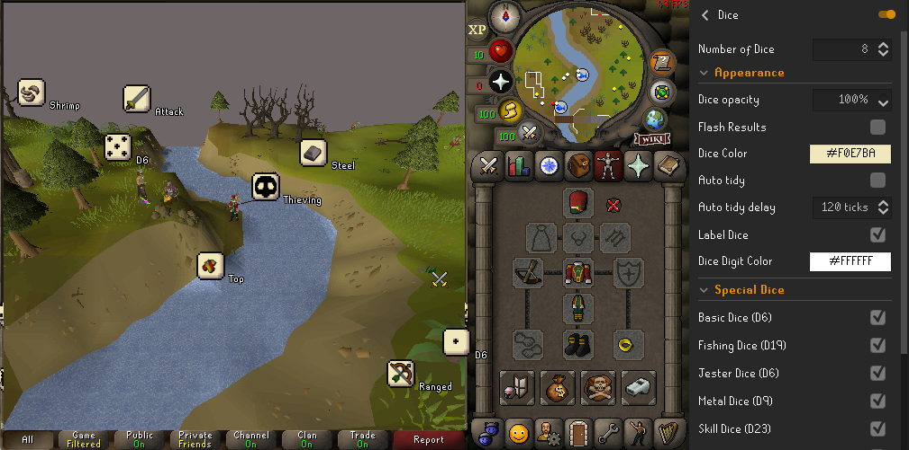
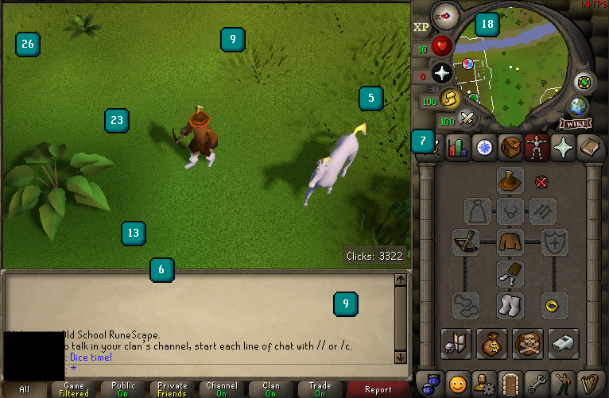

# Dice

RuneLite plugin to provide the player with Dice on screen. Adds a roll dice button to your Equipment Tab, allowing you to roll a vast array of different dice setups. The plugin is fully animated and built to be immersive, matching the crunchy OSRS style. 

Fulfill your roleplay needs or play as a "Diceman mode" account!

## Features
  - On screen **animated** dice of any amount, colour and type (eg. D6, D10, D20 etc)! 
    (To use advanced dice, put what you want in the "advanced notation" box seperated by spaces like `D10 D20 D100`.)
  - Skill, Combat Skill, Fishing and Jester dice, using authentic in-game sprites!
  - Animation is different **every time**.
  - Change the colour of the dice.
  - Change the colour of dice text.
  - Choose any amount of dice.
  - Optionally flash dice to highlight results.
  - Choose the opacity of the dice.
  - Auto-hide the dice after rolling.
  - In-game button on Equipment Tab to perform rolls.
  - Immersive & dynamic animation, dice collide & knock the edges of the game window.

## Screenshots

> *Basic dice, the player has made them white. This loops one roll, the animations are different each roll!*

> *Special dice, the player has selected multiple special dice to decide what he should do next!*

> *Advanced dice, the player has established several D10s D20s and D50s in a special colour scheme!*

## Asset Credits
Original dice sprites from [Kicked-in-teeth @ itch.io](https://kicked-in-teeth.itch.io/dice-roll), these have been modified for purposes of the mod.
